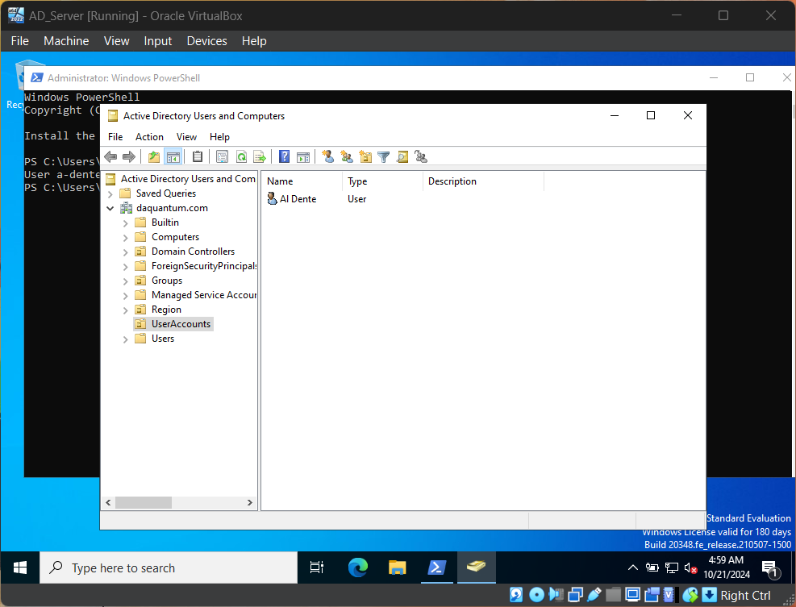

# Automated User Management with PowerShell

This project provides a comprehensive solution for managing Active Directory (AD) users through automation using PowerShell scripts. The scripts allow administrators to efficiently create, modify, and delete user accounts, significantly reducing manual effort and potential errors.

## Table of Contents

- [Project Goals](#project-goals)
- [Features](#features)
- [Prerequisites](#prerequisites)
- [Usage Instructions](#usage-instructions)
  - [Step 1: Import the Active Directory Module](#step-1-import-the-active-directory-module)
  - [Step 2: Create a New User](#step-2-create-a-new-user)
  - [Step 3: Modify User Attributes](#step-3-modify-user-attributes)
  - [Step 4: Delete a User Account](#step-4-delete-a-user-account)
  - [Step 5: Full User Management Workflow](#step-5-full-user-management-workflow)
- [Troubleshooting](#troubleshooting)
- [Summary](#summary)
- [Contributing](#contributing)


## Project Goals

- **Streamline User Management:** Automate repetitive tasks associated with user account management in Active Directory.
- **Enhance Efficiency:** Reduce time spent on user administration through automation.
- **Ensure Consistency:** Maintain uniformity in user account attributes across the organization.

---

## Features

- **User Creation:** Automate the process of creating new user accounts in AD.
- **User Modification:** Easily update user attributes such as title, department, and email.
- **User Deletion:** Remove user accounts securely from Active Directory.

---

## Prerequisites

To use these scripts, you need:
- A system running **Windows Server** or **Windows 10** with **Remote Server Administration Tools (RSAT)** installed.
- The **Active Directory Module for Windows PowerShell**.
- Sufficient permissions to perform user management tasks in Active Directory.

---

## Usage Instructions

### Step 1: Import the Active Directory Module

Before executing any scripts, import the Active Directory module to access the required cmdlets.

```powershell
Import-Module ActiveDirectory
```

#### Screenshot:


---

### Step 2: Create a New User

Run the user creation script to add new users to Active Directory. This step includes defining user details, such as username, password, and organizational unit (OU).

```powershell
# Create-User.ps1

# Parameters
param (
    [string]$username = "a-dente",
    [string]$password = "Ch3wy45!",
    [string]$firstName = "Al",
    [string]$lastName = "Dente",
    [string]$OU = "OU=UserAccounts,DC=daquantum,DC=com"
)

# Import Active Directory Module
Import-Module ActiveDirectory

# Create the user
New-ADUser -SamAccountName $username `
           -UserPrincipalName "$username@daquantum.com" `
           -Name "$firstName $lastName" `
           -GivenName $firstName `
           -Surname $lastName `
           -Path $OU `
           -AccountPassword (ConvertTo-SecureString $password -AsPlainText -Force) `
           -Enabled $true

Write-Host "User $username created successfully."
```

Run command:
```powershell
.\Create-User.ps1
```

#### Screenshot:



---

### Step 3: Modify User Attributes

After a user has been created, you can modify their attributes. This script allows you to update various user details, ensuring they remain accurate and up to date.

```powershell
# Modify-User.ps1

# Parameters
param (
    [string]$username = "a-dente",
    [string]$title = "Sales Representative",
    [string]$department = "Sales"
)

# Import Active Directory Module
Import-Module ActiveDirectory

# Modify the user
Set-ADUser -Identity $username `
           -Title $title `
           -Department $department

Write-Host "User $username modified successfully."
```

Run command:
```powershell
.\Modify-User.ps1
```

#### Screenshot:


---

### Step 4: Delete a User Account

When a user leaves the organization or no longer requires access, use the deletion script to remove their account from Active Directory.

```powershell
# Delete-User.ps1
param (
    [string]$username = "a-dente"
)

Import-Module ActiveDirectory

Remove-ADUser -Identity $username -Confirm:$false

Write-Host "User $username deleted successfully."
```

Run command:
```powershell
.\Delete-User.ps1
```

#### Screenshot:


---

### Step 5: Full User Management Workflow

For complete user lifecycle management, you can run a master script that sequentially executes user creation, modification, and deletion tasks, simplifying the process for bulk operations.

```powershell
# UserManagement.ps1

# Import Active Directory Module
Import-Module ActiveDirectory

# Create User
.\Create-User.ps1 -username "a-dente" -password "Ch3wy45!" -firstName "Al" -lastName "Dente" -OU "OU=UserAccounts,DC=daquantum,DC=com"

# Modify User
.\Modify-User.ps1 -username "a-dente" -title "Sales Representative" -department "Sales"

# Delete User
.\Delete-User.ps1 -username "a-dente"
```

Run Command:
```powershell
.\UserManagement.ps1
```
#### Screenshot:


---

## Troubleshooting

### 1. Active Directory Module Not Loaded
- **Issue**: The script fails with commands not recognized.
- **Solution**: Ensure the Active Directory module is imported:
    ```powershell
    Import-Module ActiveDirectory
    ```

### 2. Directory Object Not Found
- **Issue**: `New-ADUser` fails with "Directory object not found."
- **Solution**: 
    - Verify the Organizational Unit (OU) exists using:
      ```powershell
      Get-ADOrganizationalUnit -Filter *
      ```
    - Ensure the Distinguished Name (DN) format is correct: `OU=Users,DC=yourdomain,DC=com`.

### 3. Permissions Issue
- **Issue**: The script fails due to insufficient permissions.
- **Solution**: Run PowerShell as an Administrator and ensure the executing account has the necessary privileges to create users in the specified OU.

### 4. Password Policy Violation
- **Issue**: User creation fails due to the password not meeting requirements.
- **Solution**: Ensure the password meets your domain's complexity requirements (e.g., length, characters).

---

## Summary

This project is designed to automate Active Directory user management using PowerShell. By implementing these scripts, organizations can improve their administrative efficiency, ensuring accurate and consistent user management practices.

---

## Contributing

We welcome contributions to enhance this project. Feel free to fork the repository, create a new branch, and submit a pull request.

**Contact:**
- Email: [larose.jamel.d@gmail.com](mailto:larose.jamel.d@gmail.com)
- GitHub: [github.com/Mellymatic624](https://github.com/Mellymatic624)

